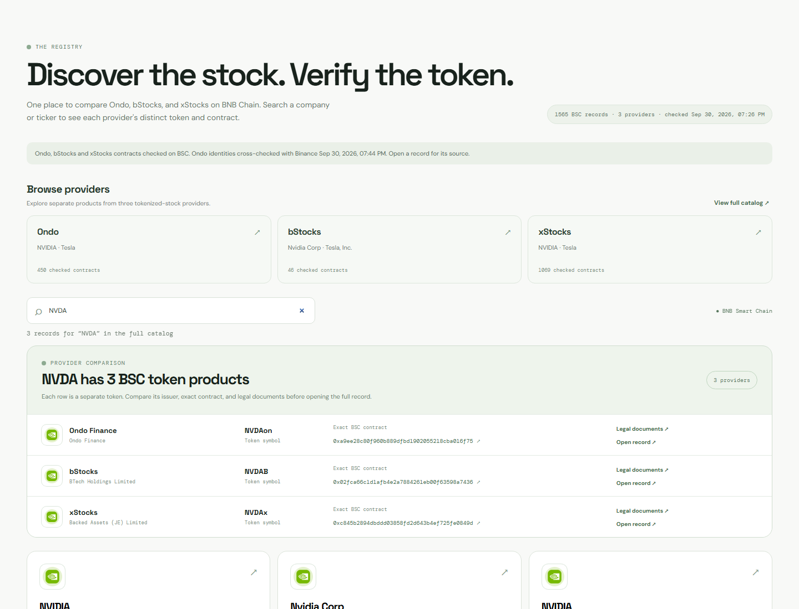

# Mintmark

Mintmark is a BSC tokenized-stock identity registry spanning **Ondo, bStocks, and xStocks**. It maps each **exact chain and contract** to a provider's published asset, checks contract name and symbol on BSC, and shows the source and evidence class for each claim. Search NVIDIA, for example, to compare NVDAon, NVDAB, and NVDAx as three separate products in an evidence matrix covering onchain identity, source records, Binance RWA coverage, report availability, wallet support, contracts, and legal documents.

For a concrete example, NVIDIA resolves to three separate BSC contracts: [Ondo NVDAon (0xa9ee…6f75)](https://bscscan.com/address/0xa9ee28c80f960b889dfbd1902055218cba016f75), [bStocks NVDAB (0x02fc…7436)](https://bscscan.com/address/0x02fca66c1d1afb4e2a7884261eb00f63598a7436), and [xStocks NVDAx (0xc845…849d)](https://bscscan.com/address/0xc845b2894dbddd03858fd2d643b4ef725fe0849d). The registry shows their full addresses and provider evidence.



**Live product:** [mintmark.nuvixes.studio](https://mintmark.nuvixes.studio) · **Source:** [github.com/Nifemi0/mintmark](https://github.com/Nifemi0/mintmark)

The production deployment serves the 1,565-record checked catalog, exact contract records, evidence, version history, live Binance-backed Ondo and bStocks company reports, and the supported wallet lookup. Exact Ondo records also link to their official provider asset page for eligible users who want to continue outside Mintmark. These are outbound provider links; Mintmark does not execute a transaction. Binance credentials stay encrypted in Vercel and are never sent to the browser. [Claims and evidence](CLAIMS.md) and [testing status](docs/submission/TESTING-STATUS.md) state what has and has not been verified.

**Data storage:** The catalog and public record history are versioned JSON snapshots loaded by the server. Production reads the same checked snapshot and does not write corrections at runtime. [Data storage and the PostgreSQL migration path](docs/DATA_STORAGE.md) explains how updates are reviewed and when persistent storage is needed.

## Run locally

Requires Node.js 22 or newer. No npm dependencies are required.

```sh
npm start
```

Open `http://localhost:4173`. The included `data/catalog.json` snapshot lets the app start without credentials or a sync: **1,565 checked BSC contracts: 450 Ondo, 46 bStocks, and 1,069 xStocks** at the last sync. Every provider retains its own contract, source, product terms, and evidence. To refresh the [Ondo contract list](https://docs.ondo.finance/addresses), the Binance RWA list's bStocks rows, and the [xStocks public asset API](https://docs.xstocks.fi/apis/openapi/assets/list_public_assets), configure Binance credentials as described below and run `npm run sync`. It checks BSC bytecode and ERC-20 name/symbol for every included contract. `npm run sync:providers` refreshes bStocks and xStocks using the existing Ondo snapshot; it also requires Binance credentials.

The directory and record view show provider-published token images. Ondo images are cached locally; `npm run sync:logos` refreshes them from Ondo's CDN and `public/logos/sources.json` records their URLs. bStocks and xStocks images load from their published image hosts. Images aid recognition only; chain and contract establish identity. If an image cannot load, the interface falls back to the ticker's initial.

To refresh bStocks or enable live Binance checks, company reports, and wallet lookup, copy `.env.example` to `.env.local` and set `OC_API_KEY` and `OC_SECRET_KEY`; restart the server. The server signs requests using the documented `/build` path and never sends credentials to the browser. The page clearly marks when a live cross-check has not run. API keys are not required to view the bundled catalog. Company and market data for xStocks remains explicitly unavailable because Mintmark has not verified a matching price source for those exact contracts.

Run focused checks with `npm test`.

## Hosting

The app is deployed on Vercel. Vercel serves `public/` as the front end and routes `/api/*` to the Node handler in Cape Town (`cpt1`). The included JSON snapshot is bundled with that handler. The public site shows the catalog, exact records, evidence, and history without a database account. Company reports, live Binance cross-checks, and wallet lookup use `OC_API_KEY` and `OC_SECRET_KEY` stored as encrypted production variables. The earlier Washington, D.C. deployment and the tested US VPS returned Binance code `40304`; Cape Town returns successful live data. Local `.env.local` is excluded from the deployed bundle, and the production build was checked for private-key matches before upload.

## What the labels mean

- **Onchain observed:** Mintmark read the token contract's name and symbol from BSC RPC. This establishes those contract responses, not backing or legal rights.
- **Issuer published:** Ondo and xStocks publish their asset identity and BSC contract. These remain provider statements, with their sources linked.
- **Unverified:** Mintmark does not independently inspect shares held by the issuer or custodian.
- **Third-party reported:** Binance provides the bStocks catalog, some company profiles, market figures, BSC token candles, and wallet balances. These are timestamped provider reports, not Mintmark's own exchange or custody observations.

The company report shows industry, public description, market cap, 52-week range, valuation and dividend fields when available. Its reference price is derived by the provider from token price and is not an official exchange quote. The 30-day chart shows **BSC token** daily closing prices, not stock-exchange history. Missing fields remain unavailable.

Wallet lookup is read-only. It sends the entered address to the server and Binance Wallet API and checks only the original **24 Ondo wallet-enabled contracts**, clearly labeled in the UI. This is a smaller subset than the 1,565-record discovery catalog; it does not scan or classify all other wallet tokens. Supported holdings link to their exact records. The public example button demonstrates a currently observed AAPLon holder; its balance may change.

Each record includes expandable claim evidence and a public version history saved in `data/registry-history.json`. A version is added only when a tracked identity field changes during `npm run sync`, or the token leaves or returns to the curated catalog. The current first versions are an initial baseline, not a claim of historical issuer changes. A catalog removal does not prove issuer retirement. Unresolved Binance identity conflicts remain visible.

The comparison view exposes an evidence matrix before a full record is opened. Official Ondo asset links are labeled **View & trade on Ondo** and include a regional-eligibility notice. No affiliate URL is currently active. Any future referral URL must remain on an approved provider domain and be labeled as an affiliate link that may compensate Mintmark.

For the submission demo, NVIDIA and TSLA each have three separate provider records. AAPL currently has two: Ondo and xStocks; the checked bStocks BSC list has no AAPL row. The legal-document links lead to each provider's documentation hub; individual final terms may need to be opened there. The current submission scope and later backlog are in [BUILD_PLAN.md](./BUILD_PLAN.md).

## Sources

- [BNB Hack brief](https://www.bnbchain.org/en/hackathons/tokenized-stocks)
- [Ondo smart contract addresses and official token list](https://docs.ondo.finance/addresses)
- [xStocks public asset API](https://docs.xstocks.fi/apis/openapi/assets/list_public_assets)
- [xStocks legal overview](https://docs.xstocks.fi/docs/product-legal-overview)
- [Binance bStocks overview](https://www.binance.com/en/academy/articles/what-are-bstocks-a-guide-to-tokenized-stocks-on-binance)
- [Binance RWA Data API](https://web3.binance.com/en/dev-docs/catalog/web3-wallet/api/rest-api/rwa-data)
- [Binance Wallet API](https://web3.binance.com/en/dev-docs/catalog/web3-wallet/api/rest-api/wallet-api)
- [Binance General Data API](https://web3.binance.com/en/dev-docs/catalog/web3-wallet/api/rest-api/general-data)
- [Binance authentication](https://web3.binance.com/en/dev-docs/authentication)
